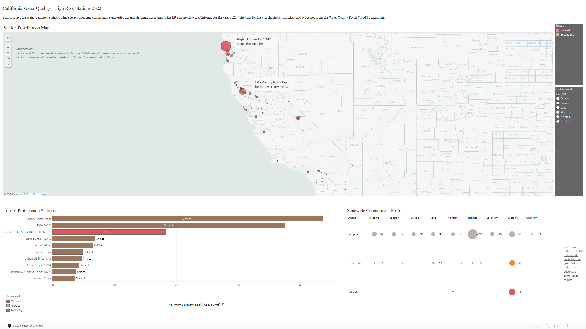

# California Water Quality Analysis 2023
 
 This project entails a comprehensive analysis of compliance of stream water at California monitor stations for the year 2023. It seeks to identify critical exceedances of EPA guidelines and limits on major inorganic toxins and contaminants, namely Arsenic, Copper, Fluoride, Lead, Mercury, Nitrates, Selenium, Uranium as well as water turbidity. These specific contaminants were chosen as they pose high level acute and chronic toxicity threats to individuals if consumed and should, therefore be closely monitored and corrective action to be discussed in the event of heavy non-conformances.

 This analysis culminates with a dashboard showing distribution of problem stations, areas of repeated limit exceedances and a breakdown of how often each contaminant shows level of exceedance out of the total number of tests drawn for the year.

## Key Insights
- Turbidity is the most problematic aspect of stream water to be addressed with a 68% exceedance rate across the whole state and 55% of non-conformities being critical. The most turbid water seems to be situated in the Del Norte County.
- Fluoride, Selenium and Uranium levels across the state for the year were fully compliant with EPA limts.
- There are extremely high levels of mercury in the stream water in the Lake County with 100% of all mercury non-conformities hailing from that region. 85% of all recorded non-conformities of mercury were critical with mostly all values having exorbitantly high severity ratios.
- Arsenic, Copper and Nitrates all had relatively low exceedance rates (9% for Arsenic, 2% for Copper and 2% for Nitrates). Arsenic is still a highly toxic contaminant and it along with lead and mercury (20% and 17.5% respectively) should still be monitored and acted on to minimize non-conformances.

**NOTE** : This project only aims to analyze frequency of non conformance of stream water at stations to EPA contaminant limits and does not aim to analyze correlation between factors or identify potential causes for said non-conformances.

 ## Methodology
 This project follows a simple yet detailed roadmap from raw, sourced data to a simple to follow, interactive vizualization which can both easily display findings whilst also paving the way for further analyses.
 
 1. ### Sourcing Raw Data
    The raw data was sourced from the [Water Quality Portal](https://www.waterqualitydata.us/#countrycode=US&statecode=US%3A06&siteType=Stream&sampleMedia=Water&mimeType=csv&sorted=no&providers=NWIS&providers=STORET) set to extract data from the stations in California for the year 2023 on stream water. This yields two CSV files containining metadata about the individual stations as well as test data throughout the year from said stations.
    - [Raw Station Data](./Data/station.csv)
    - [Raw Water Data](./Data/resultphyschem.zip)

 2. ### Data Extraction
    The raw CSV files were uploaded to an SQL Database after which, columns from both tables were extracted and merged into one [singular table](./Data/v_water_quality_analysis), holding all the information needed for the analysis. This table was then merged with a [pre-made table showing the acceptable limit for contaminants by the EPA](./Data/health_standards.csv). This new table was then saved to be used as the "master file".
   
 3. ### Data Cleaning, Validation and Standardization
    The [master file](.Data/water_quality_master_file.csv) was then taken into Excel in order to do minor cleaning such as identifying and removing blank rows, as well as standardizing data values across contaminants to match with EPA limit values for analysis of exceedance. The latter was accomplished throught the use of nested IF statements to identify the multiplicative factor relative to mg/L (standard unit). 

  4. ### Data Analysis and Summarization
     Python Pandas was then used to summarize the data into pivot tables which were then further edited in order to calculate the exceedance rate of each station, as well as how severe the non-conformances were relative to the MCL (Maximum Contaminant Limit). The final [summary table](./Data/summary_data.csv) was exported to be used in Tableau for data vizualization.

  5. ### Data Visualization with Tableau
     The summmary table was used to create the dashboard shown above. The dashboard consists of a distribution map, made with the aid of latitudinal and longitudinal data, showing the where the stations are located to help identify locational trends of conformity or lack thereof. It also includes a bar graph showing the top 10 stations with the highest recorded severity ratios as well as the contaminant in question it corresponds to. The final visualization is a Proportional Symbol chart which shows the most common compliance status of each individual contaminant as a part of the whole of the total number of tests for said contaminant done for 2023. [Click here](https://public.tableau.com/app/profile/liam.dujon/viz/WaterQualityDashboard_17712144790070/CaliforniaWaterQuality-HighRiskStations2023) to interact with it.

## Technical Definitions
 1. ### Severity Ratio
    The summary table compiles the total numbber of samples taken at a specific station for a specific contaminant. The highest recorded value (peak_result) is taken and compared to the MCL (mcl_value). The severity ratio is then calculated and categorized as follows:
    $$\text{severity ratio} = \frac{\text{peak result}}{\text{mcl value}}$$
    - **Compliant:** Severity Ratio $\le 1$
    - **Exceedant:** $1 <$ Severity Ratio $\le 5$
    - **Critical:** Severity Ratio $> 5$

 2. ### Concentration of Nitrates
    The original data had the concentration of nitrates expressed in 2 different forms - concentration as nitrate and concentration as nitrogen. For the sake of consistency, all instances where concentration was expressed as 'concentration as nitrogen' were converted to 'concentration as nitrate' using the following formula:
    
    $$\text{mg/L as } NO_3 = (\text{mg/L as N}) \times 4.427$$

 3. ### Proxy Units
    The standard units for Turbidity is NTU, however there are other units present in the original datasets. For the sake of simplicity and standardization, these units are treated as 1:1 with NTU (hence the 'is_proxy_unit' column in the master file).

